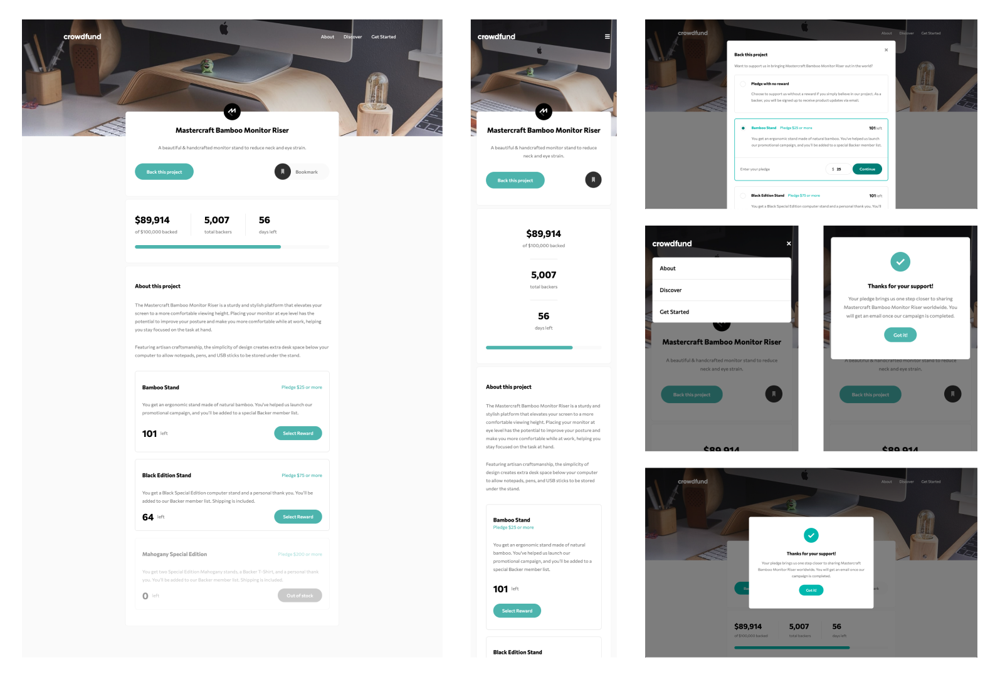

# Crowdfunding product page

## Table of contents

- [Overview](#overview)
  - [Screenshot](#screenshot)
  - [Links](#links)
- [My process](#my-process)
  - [Built with](#built-with)
  - [What I learned](#what-i-learned)
- [Author](#author)

## Overview

### Screenshot

### Links

- Live Site URL: [crowdfund product page](https://ddd-crowdfund.netlify.app/)

## My process

### Built with

- Semantic HTML5 markup
- CSS custom properties
- Flexbox
- CSS Grid
- Sass
- Javascript

### What I learned

I learn alot of things in this project, like making progress bar, hover and active state to various item, javascript function and mobile layouting.

## Author

- Twitter - [@DandunAdi](https://www.twitter.com/DandunAdi)
